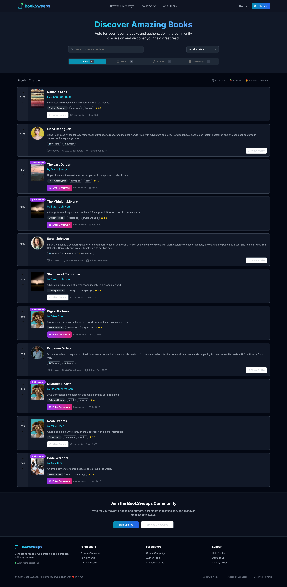

# BookSweeps 📚

The place to discover and vote on amazing books through author giveaways.



## Features

- 📖 **Book Discovery** - Browse and vote on the latest books
- 👥 **Author Profiles** - Follow your favorite authors
- 🎁 **Giveaways** - Enter book giveaways and win free copies
- 🌙 **Dark Mode** - Beautiful dark/light theme support
- 📱 **Mobile First** - Optimized for mobile with swipe gestures
- 🔍 **Search & Filter** - Find books by genre, rating, and more

## Tech Stack

- **Framework:** Next.js 15 with App Router
- **Styling:** Tailwind CSS + shadcn/ui components
- **Language:** TypeScript
- **Icons:** Lucide React
- **Theme:** Custom dark/light mode implementation

## Getting Started

### Prerequisites

- Node.js 18+ 
- npm or yarn

### Installation

1. Clone the repository:
\`\`\`bash
git clone https://github.com/yourusername/booksweeps.git
cd booksweeps
\`\`\`

2. Install dependencies:
\`\`\`bash
npm install
# or
yarn install
\`\`\`

3. Copy environment variables:
\`\`\`bash
cp .env.example .env.local
\`\`\`

4. Run the development server:
\`\`\`bash
npm run dev
# or
yarn dev
\`\`\`

5. Open [http://localhost:3000](http://localhost:3000) in your browser.

## Project Structure

\`\`\`
booksweeps/
├── app/                    # Next.js App Router
│   ├── globals.css        # Global styles
│   ├── layout.tsx         # Root layout
│   ├── loading.tsx        # Loading UI
│   └── page.tsx           # Homepage
├── components/            # Reusable components
│   ├── ui/               # shadcn/ui components
│   ├── book-card.tsx     # Book display component
│   ├── author-card.tsx   # Author display component
│   └── theme-*.tsx       # Theme components
├── public/               # Static assets
└── ...config files
\`\`\`

## Features Roadmap

- [ ] User authentication & profiles
- [ ] Database integration (Supabase/Neon)
- [ ] Real giveaway system
- [ ] Author dashboard
- [ ] Book reviews & ratings
- [ ] Social features (following, sharing)
- [ ] Email notifications
- [ ] Advanced search & filtering
- [ ] Mobile app (React Native)

## Contributing

We welcome contributions! Please see our [Contributing Guide](CONTRIBUTING.md) for details.

1. Fork the repository
2. Create your feature branch (`git checkout -b feature/amazing-feature`)
3. Commit your changes (`git commit -m 'Add some amazing feature'`)
4. Push to the branch (`git push origin feature/amazing-feature`)
5. Open a Pull Request

## Deployment

### Vercel (Recommended)

1. Push your code to GitHub
2. Connect your repository to [Vercel](https://vercel.com)
3. Deploy with zero configuration

### Other Platforms

The app can be deployed to any platform that supports Next.js:
- Netlify
- Railway
- DigitalOcean App Platform
- AWS Amplify

## Environment Variables

See `.env.example` for all available environment variables. Key variables include:

- `DATABASE_URL` - Database connection string
- `NEXTAUTH_SECRET` - Authentication secret
- `SMTP_*` - Email configuration

## License

This project is licensed under the MIT License - see the [LICENSE](LICENSE) file for details.

## Support

- 📧 Email: support@booksweeps.com
- 💬 Discord: [Join our community](https://discord.gg/booksweeps)
- 🐛 Issues: [GitHub Issues](https://github.com/yourusername/booksweeps/issues)

## Acknowledgments

- Built with [Next.js](https://nextjs.org/)
- UI components from [shadcn/ui](https://ui.shadcn.com/)
- Icons by [Lucide](https://lucide.dev/)
- Inspired by Product Hunt and Goodreads

---

Made with ❤️ for book lovers everywhere.
\`\`\`

```text file="postcss.config.js"
module.exports = {
  plugins: {
    tailwindcss: {},
    autoprefixer: {},
  },
}
